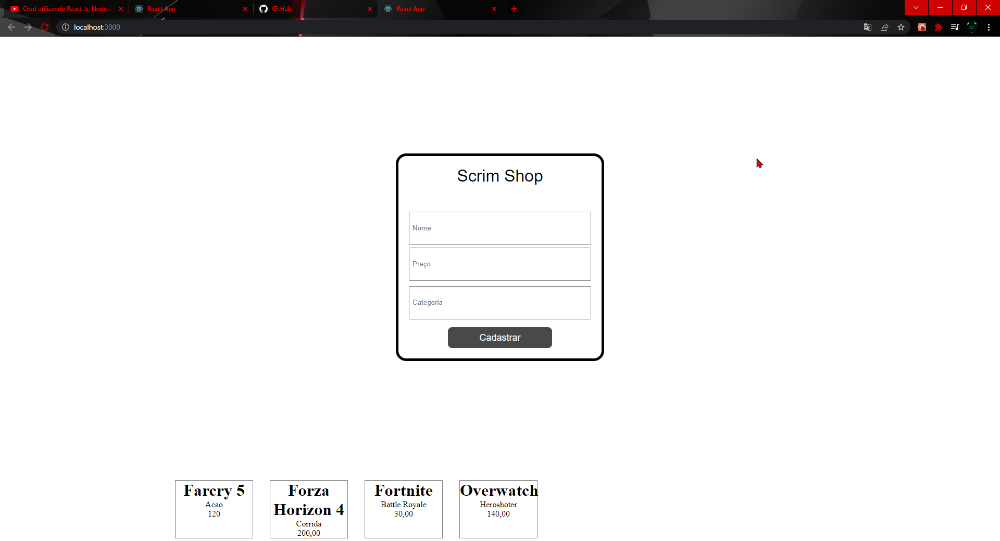
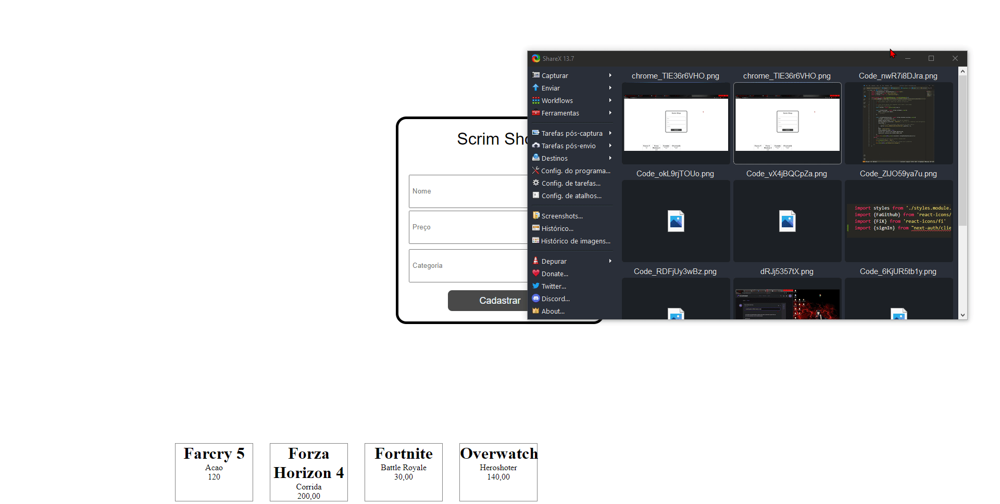

# Fins de Estudo do MYSQL

Esse Web App foi criado para fins de estudo, onde venho \
estudar como conectar o banco de dados `MYSQL` ou `React`

#
## Como executar a Aplicação
*Lembrando que a Aplicação foi dividida em duas pastas!*

### Intalando e executando o *`Client`*
primeiro devemos entrar nas pasta para isso executamos no \
terminal o comando ***`cd client`***.\
após entrasr no diretório basta executar ***`yarn install`***\
para instalar as dependencias do Front-end.\
para executarmos agora utilizaremos o ***`yarn start`***
#
### Intalando e executando o *`Server`*
Agora devemos entrar nas pasta para isso executamos no \
terminal o comando ***`cd server`***
após entrasr no diretório basta executar ***`yarn install`***\
para instalar as dependencias do do Back-End.\
para executarmos agora utilizaremos o ***`yarn start`***
#

## Depêndencias utilizadas
foram utilizadas as dependencias a seguir Server:\ 
`express` - Usado para criar as rotas e recuperar os parametros e valores passados.\ 
`cors` - para corrigir e ajudar a evitar erros na conexão com o Front.\ 
`mysql` - utilizado para armazenar os dados.